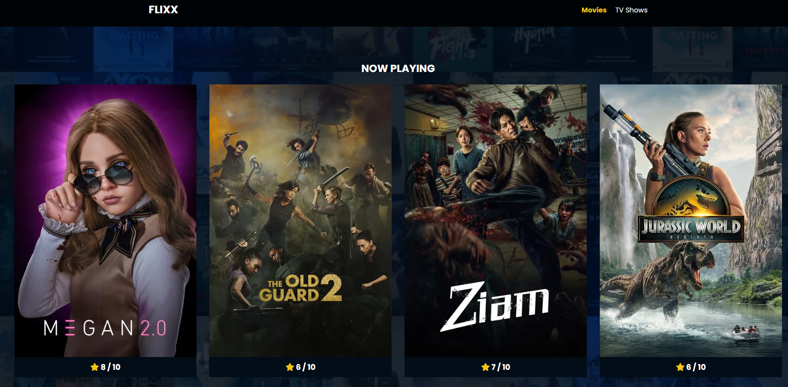
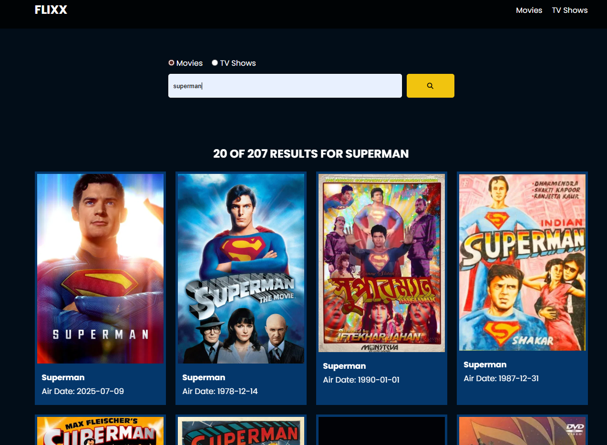

# 🎬 Flixx — Movies & TV Shows App

Welcome to **Flixx** — a simple web app for browsing, searching, and viewing details about popular movies and TV shows using **The Movie Database (TMDB) API**.

---

## 🚀 Overview

Flixx is built with **Vanilla JavaScript**, HTML & CSS.  
It uses the TMDB REST API to fetch:
- Popular movies (`/movie/popular`)
- Popular TV shows (`/tv/popular`)
- Single movie details (`/movie/{id}`)
- Single TV show details (`/tv/{id}`)
- Search results (`/search/movie` or `/search/tv`)

---

## ✨ Features

✅ Browse popular movies and TV shows  
✅ View detailed info for a movie or show  
✅ Dynamic background overlays for details pages  
✅ Search movies or shows by name  
✅ Paginated search results  
✅ Slider for now-playing movies (using **Swiper.js**)  
✅ Loading spinner and alerts

---

## ⚙️ Usage

1. **Clone or download** this repo  
2. **Add your TMDB API key** inside `script.js` under the `global` config  
3. **Open `index.html`** in your browser  
4. **Browse** movies, shows or search by keywords!

---

## ✅ Credits

- [The Movie Database (TMDB)](https://www.themoviedb.org/) — for the API  
- [Swiper.js](https://swiperjs.com/) — for the slider  
- [Font Awesome](https://fontawesome.com/) — for icons

---

## 📌 License

This project is for **learning & demonstration purposes** only.  
Feel free to **customize and extend** it for your own use!

